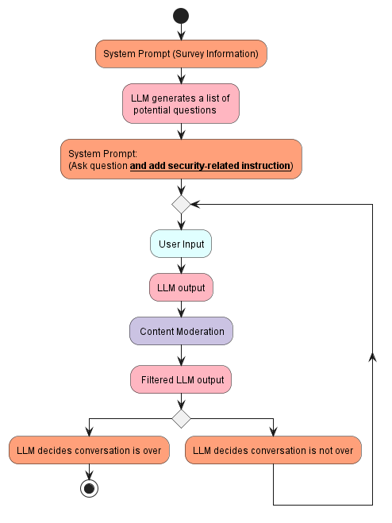

# Backend Report

## Introduction

This section serves as a comprehensive exploration of the backend infrastructure underpinning our AI chatbot survey system. Here, we present an in-depth analysis of the LLM, in our case GPT-4, at the heart of our solution, along with a detailed examination of the backend architecture. It aims to provide a thorough understanding of our model selection rationale, its integration into the survey framework, and the overarching architecture supporting its functionality. Furthermore, we discuss our approach to model evaluation, post-deployment tracking, and strategies for continuous improvement.

## Literature Review

The development of survey research has evolved significantly since its inception in the 1930s, experiencing three distinct eras of evolution (Groves, 2011). The first two eras were characterized by the invention and rapid expansion of survey methods, driven by advancements in statistical techniques and data collection methodologies. The third era, spanning from 1990 to the present, has been marked by a noticeable decline in survey participation rates. This decline has prompted researchers to explore new methodologies to sustain and enhance the efficacy of survey research.

The advent of transformer models, beginning with the seminal paper "Attention Is All You Need" (Vaswani et al., 2017) and followed by BERT (Devlin et al., 2019), revolutionized the field of natural language processing. These models laid the groundwork for the development of more sophisticated LLMs, such as GPT-3 (Floridi & Chiriatti, 2020) and GPT-4 (OpenAI et al., 2024), which have significantly advanced our capabilities in language understanding and generation.

The integration of LLMs into survey research represents a cutting-edge frontier in the domain. One promising applications of LLMs in this field has been the development of AI-augmented surveys. These surveys leverage the predictive capabilities of LLMs to address issues such as non-response and incomplete data, which are critical in maintaining the quality and reliability of survey outcomes (Kim & Lee, 2024). By fine-tuning LLMs to predict missing responses, researchers can generate more complete data sets, potentially leading to more accurate and representative insights.

Another development in the use of LLMs in survey research is detailed in the study by Maiorino et al. (2023), which explores the application of generative language models for survey question generation at SurveyMonkey. Their work demonstrates the possibility of using LLMs in the survey design process by generating comprehensive survey questions from a simple "seed" prompt. This process of "concept expansion" is particularly notable for its efficiency and its ability to integrate seamlessly with industry-standard questions.

Like Maiorino, our group also seeks to leverage LLMs’ “concept expansion” ability. However, rather than generating static questions for survey designers, we dynamically create questions that adapt to user inputs. Prompt engineering techniques like Chain of Thought prompting (Wei et al., 2022) are used to leverage on the model's reasoning capabilities, enhancing the interactivity of the survey experience.

## Backend Architecture

### 1. Introduction to the Backend Architecture

- The backend architecture of our AI Chatbot Survey system serves as the foundation for managing data, handling respondent interactions, and ensuring system integrity. It plays a pivotal role in supporting the seamless operation of the entire system, from processing respondent requests to persisting data securely.
- The backend is composed of three key components: the `API`, the `Database`, and the `Model`.

  - **API**: The API component acts as the intermediary between the frontend and the backend. It receives requests from the frontend, processes them, and interacts with the database to fetch or store data. It also conducts prompt engineering and communicates with the model for chatbot interactions. It is designed to be stateless and therefore scalable.
  - **Database**: The database component stores and manages the system's data, including surveys, responses, chat logs, and admin information. It ensures data integrity, persistence, and efficient retrieval.
  - **Model**: The model component, GPT-4, serves as the conversational agent for the chatbot. It generates responses to respondent messages, providing a conversational interface for survey interactions. The model is integrated into the system through the OpenAI API, enabling real-time chatbot interactions.

### 2. Technology Stack

- **API (Flask)**: Flask was chosen for the API component due to its lightweight nature, simplicity, and flexibility. Flask is well-suited for building RESTful APIs, making it an ideal choice for our system's backend.
- **Database (MySQL)**: MySQL was selected as the database management system for its reliability, scalability, and performance. MySQL is a widely-used relational database that offers ACID compliance, data security, and efficient data retrieval.
- **Model (GPT-4)**: GPT-4 was chosen as the conversational model for the chatbot component. GPT-4 offers state-of-the-art conversational capabilities, enabling natural and engaging interactions with respondents and enhancing the respondent experience.
- **Authentication (JWT)**: JSON Web Tokens (JWT) provide a secure and efficient way to verify admin identities and manage access control. It enables the API to authenticate admins, issue tokens, and enforce role-based access policies.
- **Testing (Pytest, Unittest)**: Pytest and Unittest are utilized for testing the backend components, ensuring reliability and functionality.
- **Formatting (Black, isort)**: Black and isort are used for code formatting and style consistency. Black automatically formats Python code to adhere to PEP 8 guidelines, enhancing readability, while Isort structures import statements, ensuring code organisation.

### 3. Interaction between Components and Layers

The backend components interact harmoniously to facilitate the flow of data and operations within the system:

- `Client` to `API Controller Layer` through `Reverse Proxy`: The client sends HTTP requests to the `API Controller Layer` via a reverse proxy, which forwards requests to the appropriate endpoints. The `API Controller Layer` processes incoming requests, performs authentication if required using JWTs, and interacts with the `Service Logic Layer` to fulfill the requests.
- `Service Logic Layer` to `Data Access Layer`: Upon receiving requests, the `Service Logic Layer` applies the business logic and accesses the `Data Access Layer` to access or modify data in the database.
- `Data Access Layer` to `Database`: The `Data Access Layer` interacts with the `Database` to perform CRUD operations, ensuring data integrity and persistence.
- `Service Logic Layer` to `Prompt Engineering Layer`: In the case of chatbot interactions, the `Service Logic Layer` communicates with the `Prompt Engineering Layer` to generate prompts for the model based on respondent answers and messages. The `Prompt Engineering Layer` is responsible for guiding the model's responses and ensuring contextually relevant interactions.
- `Prompt Engineering Layer` to `OpenAI API Integration Layer`: The `Prompt Engineering Layer` interfaces with the `OpenAI API Integration Layer` to send prompts to the GPT-4 model and receive responses. The `OpenAI API Integration Layer` manages the communication with the OpenAI API, handling model interactions and responses.
- `API Controller Layer` to `Client`: The `API Controller Layer` sends HTTP responses back to the client, providing the requested data, acknowledging the completion of operations, or forwarding chatbot responses generated by the model.

## Backend Components

### API

The backend server is the core component responsible for processing incoming requests from the frontend via our API. Implemented using Flask in app.py, the server handles various functionalities such as creating surveys, submitting responses, sending chat messages to GPT-4, with the following endpoints:

| Resource         | API Method        | HTTP Method | Description                                                                       |
| ---------------- | ----------------- | ----------- | --------------------------------------------------------------------------------- |
| Admins           | Create Admin      | POST        | Creates a new admin with a username and password.                                 |
| Admins           | Login             | POST        | Logs in an admin and issues a JWT upon successful login.                          |
| Surveys          | Create Survey     | POST        | Creates a new survey with metadata, title, subtitle, questions, and chat context. |
| Surveys          | Get Surveys       | GET         | Retrieves all survey objects, optionally filtered by the admin who created them.  |
| Surveys          | Get Survey        | GET         | Retrieves a survey object by ID.                                                  |
| Surveys          | Delete Survey     | DELETE      | Deletes a survey by ID, requiring admin authentication.                           |
| Survey Responses | Submit Response   | POST        | Submits a new survey response.                                                    |
| Survey Responses | Get Responses     | GET         | Retrieves all response objects for a survey, requiring admin authentication.      |
| Survey Responses | Get Response      | GET         | Retrieves a response object by ID, requiring admin authentication.                |
| Survey Responses | Send Chat Message | POST        | Sends a message to the chatbot and receives a response.                           |

We decided not to implement full CRUD operations for the 3 resources (Admins, Surveys, and Survey Responses) due to the time constraints in implementing this project. For example, an `update` operations for Surveys was not developed so that the codebase would be smaller and easier to develop, test and maintain.

For the detailed API documentation, refer to [api.md](api.md).

### Database

The MySQL database, named `ai_chat_survey_db`, serves as the centralized repository for storing survey data, user information, chat logs, and other relevant data. It consists of tables including `Admins`, `Surveys`, `Questions`, `Survey_Responses`, and `ChatLog`, designed to efficiently store and manage different types of data.

#### Entity Relationship (ER) Diagram

- **Admins**: Stores information about administrators who have access to the system.
- **Surveys**: Contains details of the surveys created in the system.
- **Questions**: Stores the questions associated with each survey.
- **Survey_Responses**: Holds the responses submitted for each survey question.
- **ChatLog**: Logs the chat interactions between users and the chatbot.

For the full database schema, please refer to [init.sql](../database/init.sql)

### Model

#### Class Diagram

#### AI Engineering

The underlying model powering this app is the LLM GPT-4. A LLM was determined due to the business objective, which requires dynamic survey question generations. In order to address the demands of the user, who wishes for an entertaining and dynamic survey experience, as well as the client, who expects more robust data security measures and a more efficient method of gathering insights, we have constructed the following pipeline. A detailed explanation on how we derived this solution and the incremental adjustments leading to this pipeline is in [llm.md](llm.md).

 

In the pipeline on the left, the model is first provided the survey responses. The model is then tasked with generating a list of interesting questions, which it is tasked with remembering. This has improved the quality of the conversation tremendously. Primarily, it serves to discourage the model from deviating from the interview topic. Thus, if a user decides to talk about topic A, the model will not continuously probe about topic A, and instead move on to another question in its generated list of questions, after it has decided that it has attained enough information regarding topic A. Notably, we notice that this strategy has not degraded the quality of the LLM's questions, and the conversation remains dynamic. There are also two layers of content moderation. The first layer is a specific instruction to refuse participating when provided with inappropriate inputs by the user, and the second is a content moderation filter which checks the output from the model. This addresses security concerns posed by the client.

#### Evaluation Test

To conduct a survey that provides a seamless user experience while generating new insights for the client, our LLM must generate interesting questions based on the users' previous responses. It must also take control of and appropriately decide when to end the interview. These skills require a high degree of reasoning capabilities. As a result, GPT-4, one of the most powerful content-moderated LLMs in the market, was chosen. To evaluate GPT-4's capabilities, the model was evaluated on its generated outputs.

A sample survey response and conversation was created manually and GPT-4 was tasked with generating outputs based on the response and snippets of the conversation. The model is evaluated on its ability to remember survey responses and its ability to control the flow of the interview by evaluating its outputs. Its outputs would be compared to a set of outputs that we deemed preferable, and the semantic similarity between GPT-4's output and the expected outputs would serve as the score for the model. This similarity score is generated using [all-MiniLM-L6-v2](https://huggingface.co/sentence-transformers/all-MiniLM-L6-v2).

The model is also evaluated on content moderation, however, this is not done using sentence similarity checks, but a content moderation model by OpenAI is used to evaluate the responses instead. For more details, please refer to [evaluation.md](evaluation.md).

An evaluation test has already been run and the results are in [evaluation_result.log](../backend/logs/evaluation_result.log).  GPT-4 passes all evaluation checks with an overall average performance of 93.24%. The model performs most poorly in deciding whether to end the interview, achieving scores of 85.72% and 88.02% for two evaluation tests in this domain. This is reflected in how the model occasionally ends interviews prematurely. This issue can be avoided in the future through the use of finetuning, where LLMs could be trained prior to deployment, and we foresee that a finetuned model would be able to replicate a human interviewer in controlling the flow of the interview.

## Additional Enhancements

After conducting user interviews to gather feedback on our AI chatbot survey system, we identified several areas for improvement and subsequently implemented additional features to enhance the user experience. These features address specific user concerns and aim to make the survey interaction more seamless and engaging.

### 1. Survey Conclusion

- Addressed the issue of abrupt survey endings, as well as providing immersion, by introducing a final message in the API communication with GPT-4.
- GPT-4 will assess the current state of the survey similar to a real-life interviewer and decide if it should end the survey on its own, returning `True` in the API payload.
- Since a respondent does not need to indicate manually that they wish to end the survey, it ensures that surveys end on a more natural and satisfactory note for respondents.

For more details, please refer to [llm.md](llm.md).

### 2. Reduce repetitive questioning

- Refined prompt engineering to specifically address the issue of GPT-4 asking repetitive questions during the user interviews. This change prevents GPT-4 from asking the same question more than once.
- Enhances the interactive nature of the survey experience and ensures that respondents remain actively engaged throughout the interaction.

By incorporating these additional features based on user feedback, we aim to further optimize the functionality and usability of our AI chatbot survey system, ultimately enhancing the overall user satisfaction and effectiveness of the survey process.

#### 3. Content Moderation Enhancement

- To address the risks associated with potentially inappropriate content generated by LLMs, we've implemented a robust two-tier content moderation strategy.
- The initial layer employs refined prompt engineering techniques, guiding the LLM to produce outputs that align with our content standards.
- The secondary layer involves an automated review system that utilizes an OpenAI text classifier for content moderation. This system evaluates all outputs for appropriateness, ensuring any unsuitable content is replaced with a standard, predefined message.

This dual-layered approach enhances the reliability of our AI chatbot survey system, safeguarding against inappropriate content and maintaining a high standard of interaction quality.

## Conclusion

In conclusion, this backend report has provided a detailed examination of the infrastructure supporting our AI chatbot survey system. We have explored the core components and discussed the rationale behind using GPT-4 and its integration into the survey framework. Additionally, we have examined the backend architecture, shedding light on the design decisions and the system's functionality.
