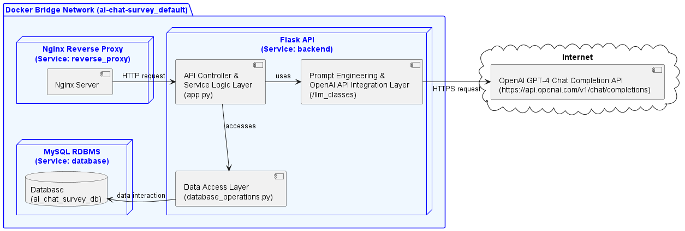

# Backend Report

## Introduction

This section serves as a comprehensive exploration of the backend infrastructure underpinning our AI chatbot survey system. Here, we present an in-depth analysis of the Large Language Model (LLM), in our case ChatGPT, at the heart of our solution, along with a detailed examination of the backend architecture. It aims to provide a thorough understanding of our model selection rationale, its integration into the survey framework, and the overarching architecture supporting its functionality. Furthermore, we discuss our approach to model evaluation, post-deployment tracking, and strategies for continuous improvement.

## Literature Review

The development of survey research has evolved significantly since its inception in the 1930s, experiencing three distinct eras of evolution (Groves, 2011). The first two eras were characterized by the invention and rapid expansion of survey methods, driven by advancements in statistical techniques and data collection methodologies. The third era, spanning from 1990 to the present, has been marked by a noticeable decline in survey participation rates. This decline has prompted researchers to explore new methodologies to sustain and enhance the efficacy of survey research.

The advent of transformer models, beginning with the seminal paper "Attention Is All You Need" (Vaswani et al., 2017) and followed by BERT (Devlin et al., 2019), revolutionized the field of natural language processing. These models laid the groundwork for the development of more sophisticated LLMs, such as GPT-3 (Floridi & Chiriatti, 2020) and GPT-4 (OpenAI et al., 2024), which have significantly advanced our capabilities in language understanding and generation.

The integration of LLMs into survey research represents a cutting-edge frontier in the domain. One promising applications of LLMs in this field has been the development of AI-augmented surveys. These surveys leverage the predictive capabilities of LLMs to address issues such as non-response and incomplete data, which are critical in maintaining the quality and reliability of survey outcomes (Kim & Lee, 2024). By fine-tuning LLMs to predict missing responses, researchers can generate more complete data sets, potentially leading to more accurate and representative insights.

Another development in the use of LLMs in survey research is detailed in the study by Maiorino et al. (2023), which explores the application of generative language models for survey question generation at SurveyMonkey. Their work demonstrates the possibility of using LLMs in the survey design process by generating comprehensive survey questions from a simple "seed" prompt. This process of "concept expansion" is particularly notable for its efficiency and its ability to integrate seamlessly with industry-standard questions.

Our group seeks to expand the use of Large Language Models in surveys by leveraging on the "concept expansion" ability of LLMs in order to create an interactive survey experience through personalised questions with the use of prompt engineering techniques such as Chain of Thought prompting (Wei et al., 2022).

## Backend Architecture

### 1. Introduction to the Backend Architecture

- The backend architecture of our AI Chatbot Survey system serves as the foundation for managing data, handling respondent interactions, and ensuring system integrity. It plays a pivotal role in supporting the seamless operation of the entire system, from processing respondent requests to persisting data securely.
- The backend is composed of three key components: the `API`, the `Database`, and the `Model`.

  - **API**: The API component acts as the intermediary between the frontend and the backend. It receives requests from the frontend, processes them, and interacts with the database to fetch or store data. It also conducts prompt engineering and communicates with the model for chatbot interactions. It is designed to be stateless and therefore scalable.
  - **Database**: The database component stores and manages the system's data, including surveys, responses, chat logs, and admin information. It ensures data integrity, persistence, and efficient retrieval.
  - **Model**: The model component, GPT-4, serves as the conversational agent for the chatbot. It generates responses to respondent messages, providing a conversational interface for survey interactions. The model is integrated into the system through the OpenAI API, enabling real-time chatbot interactions.

### 2. Technology Stack

- **API (Flask)**: Flask was chosen for the API component due to its lightweight nature, simplicity, and flexibility. Flask is well-suited for building RESTful APIs, making it an ideal choice for our system's backend. It provides a robust framework for handling HTTP requests, routing, and interacting with the database.
- **Database (MySQL)**: MySQL was selected as the database management system for its reliability, scalability, and performance. MySQL is a widely-used relational database that offers ACID compliance, data security, and efficient data retrieval. It provides robust support for complex queries, transactions, and data integrity.
- **Model (ChatGPT)**: GPT-4 was chosen as the conversational model for the chatbot component. ChatGPT offers state-of-the-art conversational capabilities, enabling natural and engaging interactions with respondents. It leverages the power of large language models to generate contextually relevant responses, enhancing the respondent experience.
- **Authentication (JWT)**: JSON Web Tokens (JWT) are used for admin authentication and authorization in the system. JWT provides a secure and efficient way to verify admin identities and manage access control. It enables the API to authenticate admins, issue tokens, and enforce role-based access policies.
- **Testing (Pytest, Unittest)**: Pytest and Unittest are utilized for testing the backend components, ensuring code quality, reliability, and functionality. Pytest offers a powerful testing framework with support for fixtures, parametrization, and test discovery. Unittest provides a built-in testing framework for writing test cases and asserting expected outcomes.
- **Formatting (Black, isort)**: Black and isort are used for code formatting and style consistency. Black automatically formats Python code to adhere to PEP 8 guidelines, enhancing readability and maintainability. Isort sorts import statements alphabetically, making code organization more structured and uniform.

### 3. Interaction between components

The backend components interact harmoniously to facilitate the flow of data and operations within the system:

- `Client` to `API Controller Layer` through `Reverse Proxy`: The client sends HTTP requests to the `API Controller Layer` via a reverse proxy, which forwards requests to the appropriate endpoints. The `API Controller Layer` processes incoming requests, performs authentication if required using JWTs, and interacts with the `Service Logic Layer` to fulfill the requests.
- `Service Logic Layer` to `Data Access Layer`: Upon receiving requests, the `Service Logic Layer` applies the business logic and accesses the `Data Access Layer` to access or modify data in the database.
- `Data Access Layer` to `Database`: The `Data Access Layer` interacts with the `Database` to perform CRUD operations, ensuring data integrity and persistence.
- `Service Logic Layer` to `Prompt Engineering Layer`: In the case of chatbot interactions, the `Service Logic Layer` communicates with the `Prompt Engineering Layer` to generate prompts for the model based on respondent answers and messages. The `Prompt Engineering Layer` is responsible for guiding the model's responses and ensuring contextually relevant interactions.
- `Prompt Engineering Layer` to `OpenAI API Integration Layer`: The `Prompt Engineering Layer` interfaces with the `OpenAI API Integration Layer` to send prompts to the GPT-4 model and receive responses. The `OpenAI API Integration Layer` manages the communication with the OpenAI API, handling model interactions and responses.
- `API Controller Layer` to `Client`: The `API Controller Layer` sends HTTP responses back to the client, providing the requested data, acknowledging the completion of operations, or forwarding chatbot responses generated by the model.

### 4. Components of the Backend Architecture

#### a. Server/API

The backend server is the core component responsible for processing incoming requests from the frontend via our API. Implemented using Flask in app.py, the server handles various functionalities such as creating surveys, submitting responses, sending chat messages to ChatGPT, with the following endpoints:

| Resource         | API Method        | HTTP Method | Description                                                                       |
| ---------------- | ----------------- | ----------- | --------------------------------------------------------------------------------- |
| Admins           | Create Admin      | POST        | Creates a new admin with a username and password.                                 |
| Admins           | Login             | POST        | Logs in an admin and issues a JWT upon successful login.                          |
| Surveys          | Create Survey     | POST        | Creates a new survey with metadata, title, subtitle, questions, and chat context. |
| Surveys          | Get Surveys       | GET         | Retrieves all survey objects, optionally filtered by the admin who created them.  |
| Surveys          | Get Survey        | GET         | Retrieves a survey object by ID.                                                  |
| Surveys          | Delete Survey     | DELETE      | Deletes a survey by ID, requiring admin authentication.                           |
| Survey Responses | Submit Response   | POST        | Submits a new survey response.                                                    |
| Survey Responses | Get Responses     | GET         | Retrieves all response objects for a survey, requiring admin authentication.      |
| Survey Responses | Get Response      | GET         | Retrieves a response object by ID, requiring admin authentication.                |
| Survey Responses | Send Chat Message | POST        | Sends a message to the chatbot and receives a response.                           |

We decided not to implement full CRUD operations for the 3 resources (Admins, Surveys, and Survey Responses) due to the time constraints in implementing this project. For example, an `update` operations for Surveys was not developed so that the codebase would be smaller and easier to develop, test and maintain.

For the detailed API documentation, refer to [api.md](api.md).

#### b. Database

The MySQL database, named `ai_chat_survey_db`, serves as the centralized repository for storing survey data, user information, chat logs, and other relevant data. It consists of tables including `Admins`, `Surveys`, `Questions`, `Survey_Responses`, and `ChatLog`, designed to efficiently store and manage different types of data.

##### Entity Relationship (ER) Diagram

- **Admins**: Stores information about administrators who have access to the system.
- **Surveys**: Contains details of the surveys created in the system.
- **Questions**: Stores the questions associated with each survey.
- **Survey_Responses**: Holds the responses submitted for each survey question.
- **ChatLog**: Logs the chat interactions between users and the chatbot.

For the full database schema, please refer to [init.sql](../database/init.sql)

#### c. Model (ChatGPT)

Tie-back to user interviews conducted by the frontend team to justify the choice of models and solutions in the backend architecture. Explanation of how the architecture aligns with user requirements and expectations gathered from user feedback.

- Add in Model Evaluation
- [Model Evaluation](evaluation.md)
- Rubrics:

  - In-depth study of performance of model and it's failings.
  - Interpretation of model

- Add in Post-Deployment Tracking and Improvement

  - Insert model evaluation
  - Rubrics:
    - Demonstrate an awareness of how model can be tracked and improved after
      deployment.

## Conclusion

In conclusion, this backend report has provided a detailed examination of the infrastructure supporting our AI chatbot survey system. We have explored the core components and discussed the rationale behind using ChatGPT and its integration into the survey framework. Additionally, we have examined the backend architecture, shedding light on the design decisions and the system's functionality.

## Citations

Devlin, J., Chang, M.-W., Lee, K., & Toutanova, K. (2019). _Bert: Pre-training of deep bidirectional transformers for language understanding_ (arXiv:1810.04805). arXiv. https://doi.org/10.48550/arXiv.1810.04805

Floridi, L., & Chiriatti, M. (2020). Gpt-3: Its nature, scope, limits, and consequences. _Minds and Machines_ , _30_ (4), 681–694. https://doi.org/10.1007/s11023-020-09548-1

Groves, R. M. (2011). Three eras of survey research. _Public Opinion Quarterly_ , _75_ (5), 861–871. https://doi.org/10.1093/poq/nfr057

Kim, J., & Lee, B. (2024). _Ai-augmented surveys: Leveraging large language models and surveys for opinion prediction_ (arXiv:2305.09620). arXiv. https://doi.org/10.48550/arXiv.2305.09620

Maiorino, A., Padgett, Z., Wang, C., Yakubovskiy, M., & Jiang, P. (2023). Application and evaluation of large language models for the generation of survey questions. _Proceedings of the 32nd ACM International Conference on Information and Knowledge Management_ , 5244–5245. https://doi.org/10.1145/3583780.3615506

OpenAI, Achiam, J., Adler, S., Agarwal, S., Ahmad, L., Akkaya, I., Aleman, F. L., Almeida, D., Altenschmidt, J., Altman, S., Anadkat, S., Avila, R., Babuschkin, I., Balaji, S., Balcom, V., Baltescu, P., Bao, H., Bavarian, M., Belgum, J., … Zoph, B. (2024). _Gpt-4 technical report_ (arXiv:2303.08774). arXiv. https://doi.org/10.48550/arXiv.2303.08774

Vaswani, A., Shazeer, N., Parmar, N., Uszkoreit, J., Jones, L., Gomez, A. N., Kaiser, L., & Polosukhin, I. (2017). _Attention is all you need_ (arXiv:1706.03762; Version 1). arXiv. https://doi.org/10.48550/arXiv.1706.03762

Wei, J., Wang, X., Schuurmans, D., Bosma, M., Ichter, B., Xia, F., Chi, E., Le, Q., & Zhou, D. (2022). _Chain-of-thought prompting elicits reasoning in large language models_ (arXiv:2201.11903; Version 1). arXiv. https://doi.org/10.48550/arXiv.2201.11903
