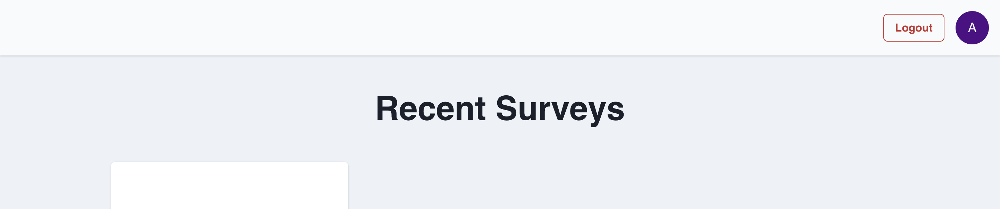

# Frontend Report

## Introduction

This section serves as an overview of the frontend architecture and design behind our web application. We explain the technical details of our implementation, as well as present the evolution of our interface and experience design based on dogfooding and user interviews, from our initial wireframes all the way to the final high-fidelity application.

## Architecture

- Implementation details
  - Routing
  - Authentication / authorisation
- Technologies used + justification
  - React
  - Chakra UI
- At most one diagram

## Initial design

We aimed to move fast to quickly show our users a minimal viable product from both a functional and aesthetic point of view. Hence, we produced one set of low-fidelity wireframes and immediately transformed them into a working web application, which we dogfooded and which users tried out during user interviews.

### Admin portal

Here are the initial wireframes for the various parts of admin portal. From left to right, top to bottom, we have the landing page, login page, signup page, admin homepage, new survey page, survey page, and survey responses page.

   

### Client interface

- Design of client interface

## Initial user interviews

The following table shows the profiles of the users we interviewed.

| User | Profile                     |
| ---- | --------------------------- |
| 1    | [age]-year-old [occupation] |
| 2    | [age]-year-old [occupation] |

The following table shows the feedback from each user as well as the refinements made for each piece of feedback.

| User | Feedback                              | Refinement                                                                    |
| ---- | ------------------------------------- | ----------------------------------------------------------------------------- |
| 1    | Unclear of importance of chat context | Emphasise importance of the chat context for the admin                        |
| 1    | Quite fun                             | NA                                                                            |
| 1    | Survey ending is abrupt               | Add final message to ask respondent if there’s anything else they want to add |

## Final design

### Admin portal

The design of the admin portal was largely unaffected by our user interviews, which focused more on the client interface. However, based on feedback on users' uncertainty about the importance of chat context, we added a tooltip to give more information on the importance of the chat context in generating good survey questions.

Based on our dogfooding of our initial implementation, we also:

- Added a header to all admin pages to enable the user to check which account they're logged into and also log out easily

Hovering over the avatar would reveal the current account's username.

- Added a section to each survey page to allow admins to easily test out the client interface
- Made survey description and chat context scroll vertically instead of horizontally for easier reading
  - In the screenshot below, note how the description and chat context are larger text boxes, rather than single lines of input as originally designed in the wireframe

### Client interface

- Design of client interface

## Follow-up user interviews

- Rubrics: Repeat consults with user.

The following table shows the feedback from each user after refinements were made.

| User | Feedback |
| ---- | -------- |
| 1    |          |

## Conclusion
