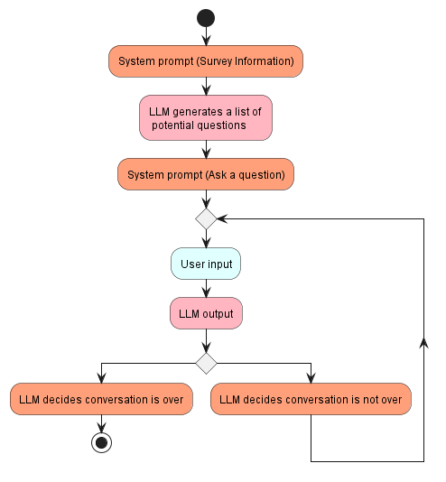

# Model Performance and Evaluation

This document describes the backend logic for the project and evaluates the performance of the AI assistant. It is intended to be read by AI engineers and other technical stakeholders.

## Introduction and Motivation

Large language models usually process conversations through this simple pipeline:
1. A system prompt is first provided to the model. This system prompt usually dictates the initial configuration of the model. For example, "You are a helpful and intelligent AI assistant" is a system prompt.
2. The user enters an input to the model.
3. The model generates an output.

### Problem Outline and Basic Pipeline

However, it will become apparent that the barebones pipeline as described above is insufficient in addressing the business problem. The following difficulties/questions arise:
1. The interview is conducted by the AI assistant. Therefore, the user should not be entering an input first.
2. Where to supply The AI assistant with contextual information for the survey, which includes:
    - Basic information about the product/service/brand.
    - Initial survey responses by the user to base the interview questions on
3. How do we ensure that the interview is carried out smoothly as a semi-structured interview?
4. How do we improve the robustness of security and mitigate jailbreaking efforts as much as possible?

## Solution

We will improve the base pipeline in several steps.

### Step 1

To ensure that the AI assistant understands the survey and the context behind it, we can simply add this context to the system prompt, and ask it to generate a chat question for the user, while, essentially, still using the basic pipeline. 

This immediately resolves problem 1. and 2.

However, the large language model will have a tendency to ask further questions which are only based on what the user has said, without moving on to other interesting aspects of the survey response. This decreases the quality of the interview drastically, and problem 3. remains.

### Step 2

Therefore, instead of a one-step initialisation, where the LLM is initialised with one system prompt (and awaits for a user input), we have constructed a three-step initialisation phase for the LLM. 

1. Firstly, the LLM is initialised with a system prompt with the survey context and response, as usual. However, instead of one question, the LLM will be tasked with generating a list of questions to ask the user.
2. The LLM will generate a list of questions for the user, based on the survey response.
3. A new system message will be added. This system message will task the LLM to greet the user and choose 1 question to ask the user. It will also be tasked with remembering the list of questions it had generated.

This method follows a similar idea as self-ask, a Chain-of-Thought prompting technique (Press et al., [2022](https://arxiv.org/pdf/2210.03350.pdf)). By asking it to generate a list of chat questions to ask and tasking it with remembering these questions, it is hoped that the LLM would remember to continue with other interesting aspects of the interview.

This resolves problems 3.

### Pipeline Step 2

### Step 3

In our current implementation of the app, the LLM has to decide when to end the chat/interview. This is to prevent the user from exiting the interview stage prematurely without any consideration to the questions. The user may still request the LLM via the chat to end the interview, just as one would in real life. However, this will take more explicit effort, and hopefully, by interacting with the chat interface, the user may be less inclined to exit the interview stage without any consideration for the questions.

Therefore, the LLM will have to access the current state of the conversation and decide if there are further responses/questions left.

> [!NOTE] We have also left a conversation limit such that the conversation does not last forever.

### Pipeline Step 3

### Pipeline Stage 4

To address the last problem of security, additional efforts are needed to finetune the system prompt.

