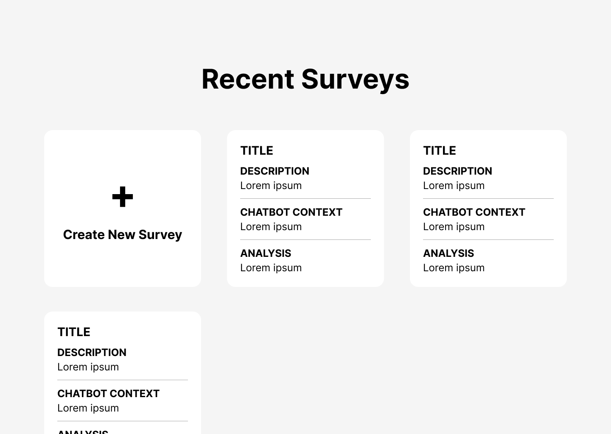
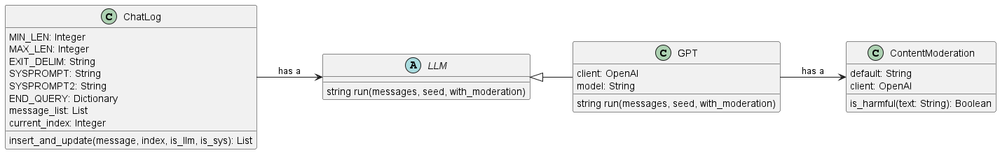

<!DOCTYPE html>
<html lang="en">
<head>
    <meta charset="UTF-8">
    <meta name="viewport" content="width=device-width, initial-scale=1.0">
    <title>Technical Report</title>
    <style>
        body {
            font-family: Arial, sans-serif;
            margin: 0;
            padding: 0;
            color: #000; /* Set default text color to black */
        }
        a {
            color: blue; /* Set link color to blue */
        }
        .header {
            background-color: #333;
            color: #fff;
            text-align: center;
            font-size: 18px;
        }
        .header h1 {
            margin: 0;
            color: #000;
        }
        .header h3 {
            margin:0;
        }
        h2 {
            text-decoration: underline; /* Underline headers */
            margin:0;
        }
        code {
            background-color: #f0f0f0; /* Set background color for inline code */
            padding: 1px 3px; /* Add padding to inline code */
            border-radius: 4px; /* Add border radius to inline code */
            color: #333; /* Set text color for inline code */
            font-weight: bold; /* Make inline code bold */
            border: 1px solid #555; /* Add border around inline code */
        }
        .team {
            background-color: #f0f0f0;
            color: #000; /* Set font color to black */
            padding: 10px;
            text-align: center;
        }
        pre {
            border: 1px solid #555; /* Add border around code blocks */
            padding: 10px; /* Add padding to code blocks */
            border-radius: 4px; /* Add border radius to code blocks */
            overflow-x: auto; /* Enable horizontal scrolling if needed */
        }
    </style>
</head>
<body>
    <!-- Header -->
    <div class="header">
        <h1>Technical Report for Project 7: Interactive Survey Interface</h1>
        <h3>Team: Full Stack Full Send</h3>
    </div>
</body>
</html>

## Table of Contents

1. [Project Introduction](#project-introduction)
2. [Repository Structure](#repository-structure)
3. [Setup](#setup)
   - [Installing the Application](#installing-the-application)
   - [Running the Application](#running-the-application)
   - [Stopping the Application](#stopping-the-application)
4. [Overall Architecture](#overall-architecture)
   - [Services](#services)
   - [Technology Stack](#technology-stack)
5. [Frontend](#frontend)
   - [Introduction](#frontend-introduction)
   - [Architecture](#architecture)
     - [UI Libraries](#ui-libraries)
     - [Authentication](#authentication)
     - [Authorization](#authorization)
   - [Initial Design](#initial-design)
     - [Admin Portal](#admin-portal)
     - [Client Interface](#client-interface)
     - [Initial User Interviews](#initial-user-interviews)
   - [Final Design](#final-design)
     - [Updated Admin Portal](#updated-admin-portal)
     - [Updated Client Interface](#updated-client-interface)
     - [Follow-up User Interviews](#follow-up-user-interviews)
   - [Frontend Conclusion](#frontend-conclusion)
6. [Backend](#backend)
   - [Introduction](#backend-introduction)
   - [Literature Review](#literature-review)
   - [Backend Architecture](#backend-architecture)
     - [Introduction to the Backend Architecture](#1-introduction-to-the-backend-architecture)
     - [Technology Stack](#2-technology-stack)
     - [Interaction between Components and Layers](#3-interaction-between-components-and-layers)
   - [Backend Components](#backend-components)
     - [API](#api)
     - [Database](#database)
     - [Model](#model)
     - [Additional Enhancements](#additional-enhancements)
     - [Backend conclusion](#backend-conclusion)
7. [DevOps](#devops)
8. [Future Directions and Recommendations](#future-directions-and-recommendations)
   - [Additional Features](#additional-features)
   - [Analyzing ChatLogs](#analyzing-chatlogs)
   - [Chatbot Personas](#chatbot-personas)
   - [Local LLMs](#local-llms)
9. [Conclusion](#conclusion)
10. [Citations](#citations)

## Project Introduction

In today's rapidly evolving business landscape, understanding customer needs and preferences is the cornerstone of success. Traditional survey methods, while informative, often fall short in capturing the intricacies of consumer behavior and sentiment.

In this report, we unveil a proof-of-concept project poised to revolutionize the way businesses conduct customer research. Leveraging the power of Large Language Models (LLMs), particularly GPT-4, we're introducing a dynamic and personalized survey experience that transcends the limitations of conventional approaches.

Our vision is simple yet transformative: to create surveys that adapt in real-time based on each respondent's unique input. By integrating GPT-4 into our survey platform, we're not only collecting data but engaging customers in meaningful conversations. This innovative approach enables us to pursue unique lines of inquiry, uncovering insights that traditional surveys often miss.

## Repository Structure
```
ai-chat-survey/
│
├── .github/                   # Github workflows and codeowners configuration files
│
├── backend-gpu/               # Backend-gpu specific files
│
├── backend/                   # Backend specific files
│
├── database/                  # Database specific files
│
├── docs/                      # Documentation files
│
├── frontend/                  # Frontend specific files
│
├── reverse-proxy/             # Reverse proxy specific files
│
├── scripts/                   # Scripts for integration tests, setup, etc.
├── .gitignore                 # Specifies intentionally untracked files to ignore
├── README.md                  # Main project README with general information
├── compose.eval.yaml          # Docker Compose file for the LLM evaluation
├── compose.gpu.yaml           # Docker Compose file for GPU version of the application for local LLMs
├── compose.ssl.yaml           # Docker Compose file for reverse proxy and certbot
├── compose.tests.yaml         # Docker Compose file for the integration tests
├── compose.yaml               # Docker Compose file for the application
└── sample.env                 # Sample environment variables
```

## Setup

Our project has been deployed, and is accessible via the following link: [https://www.ai-chat-survey.xyz/](https://www.ai-chat-survey.xyz/). Users can easily create an account, log in, create surveys, and participate in surveys to fully experience the product.

We've also prepared a [sample survey](https://www.ai-chat-survey.xyz/chat/1) to allow users to explore the product from a respondent's perspective.

Alternatively, follow the steps below to install and run the application on a local machine.

### Installing the Application

1. Install [Docker](https://www.docker.com/get-started) and [Docker Compose](https://docs.docker.com/compose/install/).

2. Initialise `.env` file (use `copy` for Windows CMD):

```
  cp sample.env .env
```

3. Fill in the `.env` file with the necessary environment variables. Some of the variables are already filled in with default values.

### Running the Application

   ```
     docker-compose up -d --build
   ```

If you want to horizontally scale (application level) the frontend or backend services, you can use the following command (do not scale the database service or nginx service):

   ```
     docker-compose up -d --scale frontend=2 --scale backend=2
   ```

### Stopping the Application

   ```
     docker-compose down
   ```

Further details about setup/installation can be found in [setup.md](https://github.com/pakshuang/ai-chat-survey/blob/main/docs/setup.md), such as:

- Backend Development Environment
- Testing (Backend)
- Frontend Development Environment
- Deployment

<div style="page-break-after: always;"></div>

## Overall Architecture


### Services

- **Reverse Proxy (Nginx)**: Handles incoming requests and routes them to the backend or frontend. This unifies the frontend and backend under a single domain and allows for easy scaling of the frontend and backend services as well as avoids CORS issues.
- **SSL Certificate Client (Certbot)**: Automatically fetches and renews SSL certificates from Let's Encrypt. This ensures that the application is served over HTTPS, providing a secure connection for users.
- **Frontend (React)**: User interface for the application. It can be scaled horizontally to handle more users.
- **Backend (Flask)**: Handles the business logic and interacts with the database. It can be scaled horizontally to handle more users.
- **Database (MySQL)**: Stores the data for the application.

### Technology Stack

- **Reverse Proxy (Nginx)**: Nginx was chosen due to its simplicity and performance. It is used to route requests to the frontend or backend based on the URL path. Load balancing relies on the Docker network's internal DNS resolution. For more advanced load balancing, solutions like Traefik can be used due to its dynamic configuration capabilities and support for Docker.
- **SSL Certificate Client (Certbot)**: Certbot was chosen for its ease of use and integration with Let's Encrypt.
- The rationale for the choice of technologies for the other services can be found in the respective sections below.

<div style="page-break-after: always;"></div>

## Frontend

### Frontend Introduction

This section serves as an overview of the frontend architecture and design behind our web application. We explain the technical details of our implementation, as well as present the evolution of our interface and experience design based on dogfooding and user interviews, from our initial wireframes all the way to the final high-fidelity application.

### Architecture

#### UI Libraries

We use React to leverage its modular approach, which allows developers to write smaller, self-contained components that can be put together and reused across different parts of an application to build complex user interfaces. React's virtual DOM also enhances performance by minimising unnecessary updates to the actual DOM, only re-rendering parts of the DOM that have changed. We also use Chakra UI's pre-made components to speed up the development process and ensure a consistent design across the application.

#### Authentication

Users can authenticate into the admin portal using a username and password, whose validity is verified by the backend. Upon login, our backend sends a JWT, which is stored with the username in `localStorage`. Storing the JWT in memory was not chosen as it would require a new token with every page refresh, causing inconvenience. Furthermore, while storing the JWT in a same-site cookie would have been more secure, it is complicated to implement, and thus was not done due to time constraints. Storing the JWT in `localStorage` is still secure as it is not automatically sent with every HTTP request like cookies are, reducing the risk of CSRF (Cross-Site Request Forgery) attacks. `localStorage` access is also typically faster than cookie access.

#### Authorization

Admin routes are protected, except the signup and login pages; unauthorized users who try to access admin routes will be redirected to the login page. Furthermore, admins are only authorized to access their own surveys and responses. Client routes, however, are accessible by everyone.

### Initial design

Our goal was to swiftly deliver a minimal viable product to our users, focusing on both functionality and aesthetics. To achieve this, we created low-fidelity wireframes and promptly developed them into a functional web application. We tested the app and gathered user feedback during interviews.

Note that our favicon, selected to illustrate the AI capabilities of our app, is by [Pexelpy](https://freeicons.io/profile/433683) on [freeicons.io](https://freeicons.io).

#### Admin portal

Here are the initial wireframes for the various parts of admin portal. From left to right, top to bottom, we have the landing page, login page, signup page, admin homepage, new survey page, survey page, and survey responses page.

Admins are able to:

- Sign up and log into their account.
- View all surveys they have created in descending order of creation time.
- Create new surveys with titles, descriptions, and chat context, as well as MCQ, MRQs, and free response questions.
- View a survey and its responses, including the dynamic conversations with the chatbot.
- Delete a survey.
- Log out of their account.


<div style="text-align: center;">
  
  
  
  
  
  
  
</div>

#### Client interface

We aimed to maintain information collection efficiency while incorporating a conversational, chat-like format. This concept led us to develop two separate pages:

- Survey page: This is the page for static questions, i.e. questions that the surveyor wants all users to answer, allowing easy traditional quantitative analysis. Questions can be multiple choice, multiple response, and free response.

<div style="text-align: center;">

</div>

- Chat page: After the initial survey page, the user's answers are sent to a chatbot and users are redirected to the chat page where they engage in a conversation with the chatbot.
<div style="text-align: center;">

</div>

### Initial user interviews

The following table shows the profiles of the users we interviewed.

<style>
/* Style for the first table */
#table1 th:first-of-type {
    width: 10%;
}
#table1 th:nth-of-type(2) {
    width: 90%;
}
#table2 th:first-of-type {
    width: 10%;
}
#table2 th:nth-of-type(2) {
    width: 60%;
}
#table2 th:nth-of-type(3) {
    width: 15%;
}
#table2 th:nth-of-type(4) {
    width: 15%;
}
#table3 th:first-of-type {
    width: 10%;
}
#table3 th:nth-of-type(2) {
    width: 90%;
}
#table4 th:first-of-type {
    width: 10%;
}
#table4 th:nth-of-type(2) {
    width: 20%;
}
#table4 th:nth-of-type(3) {
    width: 10%;
}
#table4 th:nth-of-type(4) {
    width: 50%;
}
</style>

<div id="table1" style="text-align: center">

| User | Profile                           |
| ---- |-----------------------------------|
| 1    | 50+ year-old banker               |
| 2    | 50+ year-old marketing specialist |
| 3    | 22-year-old university student    |
| 4    | Our business stakeholder          |
| 5    | 24-year-old university student    |
</div>

The following table shows their feedback, both positive and negative.

<div style="page-break-after: always;"></div>

<div id="table2" style="text-align: center">

| User | Feedback                                                                                             | Change made? | Change in |
| ---- | ---------------------------------------------------------------------------------------------------- |--------------|-----------|
| 1    | Unclear of importance of chat context                                                                | Yes          | Frontend  |
| 1    | Need to wait for each question                                                                       | No           | NA        |
| 1    | Survey ending is abrupt                                                                              | Yes          | Backend   |
| 1    | Quite fun                                                                                            | NA           | NA        |
| 2    | Felt more compelled to continue the survey and give information because of the conversational nature | NA           | NA        |
| 3    | Add ability to include images, graphs                                                                | No           | Both      |
| 3    | Bot has the tendency to rephrase / repeat some questions                                             | Yes          | Backend   |
| 3    | Chat is quite responsive, feels natural                                                              | NA           | NA        |
| 4    | Consider security: prevent discriminatory words in LLM output                                        | Yes          | Backend   |
| 4    | Add ability to split the survey up into sections                                                     | No           | Both      |
| 5    | Survey section doesn't look like anything new                                                        | Yes          | Frontend  |
| 5    | Chat is awkward to read because of distance between bubbles                                          | Yes          | Frontend  |
</div>

Some user feedback required changes to the backend, not the frontend. We thus discuss these changes later in the backend section of the report. Furthermore, we did not implement a few changes due to time constraints (indicated by “No” in the “Change made” column), but could be added in the future. Finally, while we understand User 1's comment on having to wait for each question, the speed of generation by GPT-4 is out of our control, so we were unable to act on their feedback.

### Final design

#### Updated Admin portal

The design of the admin portal was largely unaffected by our user interviews, which focused more on the client interface. However, based on User 1's feedback on their uncertainty about the importance of chat context, we added a tooltip to give more information on the importance of the chat context in generating good survey questions.

<div style="text-align: center;">

</div>

Based on our own testing of our initial implementation, we also:

- Added a header to all admin pages to enable the user to check which account they're logged into and also log out easily

<div style="text-align: center;">

</div>

Hovering over the avatar would reveal the current account's username.

- Added a section to each survey page to allow admins to easily test out the client interface
- Made survey description and chat context scroll vertically instead of horizontally for easier reading
  - In the screenshot below, note how the description and chat context are larger text boxes, rather than single lines of input as originally designed in the wireframe

<div style="text-align: center;">

</div>

#### Updated Client interface

We implemented the following changes based on user feedback:

- Added a "thank you" message after the bot is done asking questions to make the ending of the survey less abrupt as feedbacked by User 1. This addition was accomplished by implementing a flag that indicates whether the bot's message will be its last.

<div style="text-align: center;">
  
</div>

- Integrated survey page into chat page.
  User 5 found the survey page's design too similar to traditional surveys, reducing their desire to complete the survey. However, as business stakeholders still wanted the static questions to be asked, we could not remove the static questions entirely. Thus, we integrated them into the chat page to provide the experience of chatting with the LLM.

- Made chat page interface more similar to ChatGPT's.
  User 5 also commented that our original chatpage was awkward to read because of the distance between the two chat bubbles on a laptop screen. We also felt that chat bubbles might be too reminiscent of poorly-performing AI chatbots used by other companies for customer support, turning users off before they recognize the capabilities of our own chatbot. Thus, we changed our chat UI to be more similar to ChatGPT's, a more well-regarded AI software, to establish a sense of trust.

- Displayed messages from bottom to top.
  After the integration, we realised that the traditional way of showing messages from the top to bottom of the page might cause inconvenience for users at the beginning, who would have to go back and forth between reading the question at the top and filling out their answers in the chatbox at the bottom. Thus, we changed the direction of message display to position the latest question and chatbox close together.

<div style="text-align: center;">
  
</div>

<div style="page-break-after: always;"></div>

#### Follow-up user interviews

The following table shows feedback from our follow-up user interviews after refinements were made.

<div id="table3" style="text-align: center">

| User | Feedback                                                                                               |
|------|--------------------------------------------------------------------------------------------------------|
| 1    | Having the MCQ/MRQ/free response questions inside the chat input box itself makes the process seamless |
| 2    | Conversation feels a lot more natural, feels like I am talking to a real human being.                  |
| 3    | A good experience; sounds more natural than before                                                     |
| 4    | Chatbot's ability to ask good questions and clarify is great                                           |
| 4    | Is it possible to add functionality to finetune a specific survey?                                     |
| 4    | Can the chatbot be coerced to produce shorter messages?                                                |
| 4    | Having the bot be able to take on specific personas would help keep the user engaged                   |
| 5    | Feels very smooth answering the survey via the chatbox                                                 |
| 5    | Chat UI still a bit awkwardly boxy, but much cleaner than before                                       |
</div>

Some users further suggested features or enhancements that we could include; we address these in our Future Directions and Recommendations section.

### Frontend Conclusion

Our frontend has been thoughtfully designed with React and Chakra UI to craft a visually appealing, interactive interface that encourages user engagement. Authentication and authorization measures also secure admin routes and data, while future enhancements may explore more robust storage options. Overall, we have created a modern, engaging web application that can help boost survey completion rates and enhance product development with targeted qualitative feedback.

<div style="page-break-after: always;"></div>

## Backend

### Backend Introduction

This section serves as a comprehensive exploration of the backend infrastructure underpinning our AI chatbot survey system. Here, we present an in-depth analysis of the LLM, in our case GPT-4, at the heart of our solution, along with a detailed examination of the backend architecture. It aims to provide a thorough understanding of our model selection rationale, its integration into the survey framework, and the overarching architecture supporting its functionality. Furthermore, we discuss our approach to model evaluation, post-deployment tracking, and strategies for continuous improvement.

### Literature Review

The development of survey research has evolved significantly since its inception in the 1930s, experiencing three distinct eras of evolution (Groves, 2011). The first two eras were characterized by the invention and rapid expansion of survey methods, driven by advancements in statistical techniques and data collection methodologies. The third era, spanning from 1990 to the present, has been marked by a noticeable decline in survey participation rates. This decline has prompted researchers to explore new methodologies to sustain and enhance the efficacy of survey research.

The advent of transformer models, beginning with the seminal paper "Attention Is All You Need" (Vaswani et al., 2017) and followed by BERT (Devlin et al., 2019), revolutionized the field of natural language processing. These models laid the groundwork for the development of more sophisticated LLMs, such as GPT-3 (Floridi & Chiriatti, 2020) and GPT-4 (OpenAI et al., 2024), which have significantly advanced our capabilities in language understanding and generation.

The integration of LLMs into survey research represents a cutting-edge frontier in the domain. One promising applications of LLMs in this field has been the development of AI-augmented surveys. These surveys leverage the predictive capabilities of LLMs to address issues such as non-response and incomplete data, which are critical in maintaining the quality and reliability of survey outcomes (Kim & Lee, 2024). By fine-tuning LLMs to predict missing responses, researchers can generate more complete data sets, potentially leading to more accurate and representative insights.

Another development in the use of LLMs in survey research is detailed in the study by Maiorino et al. (2023), which explores the application of generative language models for survey question generation at SurveyMonkey. Their work demonstrates the possibility of using LLMs in the survey design process by generating comprehensive survey questions from a simple "seed" prompt. This process of "concept expansion" is particularly notable for its efficiency and its ability to integrate seamlessly with industry-standard questions.

Like Maiorino, our group also seeks to leverage LLMs’ “concept expansion” ability. However, rather than generating static questions for survey designers, we dynamically create questions that adapt to user inputs. Prompt engineering techniques like Chain of Thought prompting (Wei et al., 2022) are used to leverage on the model's reasoning capabilities, enhancing the interactivity of the survey experience.

<div style="page-break-after: always;"></div>

### Backend Architecture

#### 1. Introduction to the Backend Architecture


- The backend architecture of our AI Chatbot Survey system serves as the foundation for managing data, handling respondent interactions, and ensuring system integrity. It plays a pivotal role in supporting the seamless operation of the entire system, from processing respondent requests to persisting data securely.
- The backend is composed of three key components: the `API`, the `Database`, and the `Model`.

  - **API**: The API component acts as the intermediary between the frontend and the backend. It receives requests from the frontend, processes them, and interacts with the database to fetch or store data. It also conducts prompt engineering and communicates with the model for chatbot interactions. It is designed to be stateless and therefore scalable.
  - **Database**: The database component stores and manages the system's data, including surveys, responses, chat logs, and admin information. It ensures data integrity, persistence, and efficient retrieval.
  - **Model**: The model component, GPT-4, serves as the conversational agent for the chatbot. It generates responses to respondent messages, providing a conversational interface for survey interactions. The model is integrated into the system through the OpenAI API, enabling real-time chatbot interactions.

#### 2. Technology Stack

- **API (Flask)**: Flask was chosen for the API component due to its lightweight nature, simplicity, and flexibility. Flask is well-suited for building RESTful APIs, making it an ideal choice for our system's backend.
- **Database (MySQL)**: MySQL was selected as the database management system for its reliability, scalability, and performance. MySQL is a widely-used relational database that offers ACID compliance, data security, and efficient data retrieval.
- **Model (GPT-4)**: GPT-4 was chosen as the conversational model for the chatbot component. GPT-4 offers state-of-the-art conversational capabilities, enabling natural and engaging interactions with respondents and enhancing the respondent experience.
- **Authentication (JWT)**: JSON Web Tokens (JWT) provide a secure and efficient way to verify admin identities and manage access control. It enables the API to authenticate admins, issue tokens, and enforce role-based access policies.
- **Testing (Pytest, Unittest)**: Pytest and Unittest are utilized for testing the backend components, ensuring reliability and functionality.
- **Formatting (Black, isort)**: Black and isort are used for code formatting and style consistency. Black automatically formats Python code to adhere to PEP 8 guidelines, enhancing readability, while Isort structures import statements, ensuring code organisation.

#### 3. Interaction between Components and Layers

The backend components interact harmoniously to facilitate the flow of data and operations within the system:

- `Client` to `API Controller Layer` through `Reverse Proxy`: The client sends HTTP requests to the `API Controller Layer` via a reverse proxy, which forwards requests to the appropriate endpoints. The `API Controller Layer` processes incoming requests, performs authentication if required using JWTs, and interacts with the `Service Logic Layer` to fulfill the requests.
- `Service Logic Layer` to `Data Access Layer`: Upon receiving requests, the `Service Logic Layer` applies the business logic and accesses the `Data Access Layer` to access or modify data in the database.
- `Data Access Layer` to `Database`: The `Data Access Layer` interacts with the `Database` to perform CRUD operations, ensuring data integrity and persistence.
- `Service Logic Layer` to `Prompt Engineering Layer`: In the case of chatbot interactions, the `Service Logic Layer` communicates with the `Prompt Engineering Layer` to generate prompts for the model based on respondent answers and messages. The `Prompt Engineering Layer` is responsible for guiding the model's responses and ensuring contextually relevant interactions.
- `Prompt Engineering Layer` to `OpenAI API Integration Layer`: The `Prompt Engineering Layer` interfaces with the `OpenAI API Integration Layer` to send prompts to the GPT-4 model and receive responses. The `OpenAI API Integration Layer` manages the communication with the OpenAI API, handling model interactions and responses.
- `API Controller Layer` to `Client`: The `API Controller Layer` sends HTTP responses back to the client, providing the requested data, acknowledging the completion of operations, or forwarding chatbot responses generated by the model.

### Backend Components

#### API

The backend server is the core component responsible for processing incoming requests from the frontend via our API. Implemented using Flask in app.py, the server handles various functionalities such as creating surveys, submitting responses, sending chat messages to GPT-4, with the following endpoints:

<div id="table4" style="text-align: center">

| Resource         | API Method        | HTTP Method | Description                                                                       |
| ---------------- | ----------------- | ----------- | --------------------------------------------------------------------------------- |
| Admins           | Create Admin      | POST        | Creates a new admin with a username and password.                                 |
| Admins           | Login             | POST        | Logs in an admin and issues a JWT upon successful login.                          |
| Surveys          | Create Survey     | POST        | Creates a new survey with metadata, title, subtitle, questions, and chat context. |
| Surveys          | Get Surveys       | GET         | Retrieves all survey objects, optionally filtered by the admin who created them.  |
| Surveys          | Get Survey        | GET         | Retrieves a survey object by ID.                                                  |
| Surveys          | Delete Survey     | DELETE      | Deletes a survey by ID, requiring admin authentication.                           |
| Survey Responses | Submit Response   | POST        | Submits a new survey response.                                                    |
| Survey Responses | Get Responses     | GET         | Retrieves all response objects for a survey, requiring admin authentication.      |
| Survey Responses | Get Response      | GET         | Retrieves a response object by ID, requiring admin authentication.                |
| Survey Responses | Send Chat Message | POST        | Sends a message to the chatbot and receives a response.                           |

</div>

We decided not to implement full CRUD operations for the 3 resources (Admins, Surveys, and Survey Responses) due to the time constraints in implementing this project. For example, `update` operations for Surveys were not implemented so that the codebase would be smaller and easier to develop, test and maintain.

For the detailed API documentation, refer to [api.md](https://github.com/pakshuang/ai-chat-survey/blob/main/docs/api.md).

#### Database

The MySQL database, named `ai_chat_survey_db`, serves as the centralized repository for storing survey data, user information, chat logs, and other relevant data. It consists of tables including `Admins`, `Surveys`, `Questions`, `Survey_Responses`, and `ChatLog`, designed to efficiently store and manage different types of data.

##### Entity Relationship (ER) Diagram

<div style="text-align: center;">

</div>

- **Admins**: Stores information about administrators who have access to the system.
- **Surveys**: Contains details of the surveys created in the system.
- **Questions**: Stores the questions associated with each survey.
- **Survey_Responses**: Holds the responses submitted for each survey question.
- **ChatLog**: Logs the chat interactions between users and the chatbot.

For the full database schema, please refer to [init.sql](https://github.com/pakshuang/ai-chat-survey/blob/main/database/init.sql).

#### Model

##### Class Diagram



##### AI Engineering

The underlying model powering this app is the LLM GPT-4. A LLM was determined due to the business objective, which requires dynamic survey question generations. In order to address the demands of the user, who wishes for an entertaining and dynamic survey experience, as well as the client, who expects more robust data security measures and a more efficient method of gathering insights, we have constructed the following pipeline. A detailed explanation on how we derived this solution and the incremental adjustments leading to this pipeline is in [llm.md](https://github.com/pakshuang/ai-chat-survey/blob/main/docs/llm.md).

<div style="float: left; margin: 0px 0px 0px 0px;">

</div>
<br>

In the pipeline on the left, the model is first provided the survey responses. The model is then tasked with generating a list of interesting questions, which it is tasked with remembering. This has improved the quality of the conversation tremendously. Primarily, it serves to discourage the model from deviating from the interview topic. Thus, if a user decides to talk about topic A, the model will not continuously probe about topic A, and instead move on to another question in its generated list of questions, after it has decided that it has attained enough information regarding topic A. Notably, we notice that this strategy has not degraded the quality of the LLM's questions, and the conversation remains dynamic. There are also two layers of content moderation. The first layer is a specific instruction to refuse participating when provided with inappropriate inputs by the user, and the second is a content moderation filter which checks the output from the model. This addresses security concerns posed by the client.

##### Evaluation Test

To conduct a survey that provides a seamless user experience while generating new insights for the client, our LLM must generate interesting questions based on the users' previous responses. It must also take control of and appropriately decide when to end the interview. These skills require a high degree of reasoning capabilities. As a result, GPT-4, one of the most powerful content-moderated LLMs in the market, was chosen. To evaluate GPT-4's capabilities, the model was evaluated on its generated outputs.

A sample survey response and conversation was created manually and GPT-4 was tasked with generating outputs based on the response and snippets of the conversation. The model is evaluated on its ability to remember survey responses and its ability to control the flow of the interview by evaluating its outputs. Its outputs would be compared to a set of outputs that we deemed preferable, and the semantic similarity between GPT-4's output and the expected outputs would serve as the score for the model. This similarity score is generated using [all-MiniLM-L6-v2](https://huggingface.co/sentence-transformers/all-MiniLM-L6-v2).

The model is also evaluated on content moderation, however, this is not done using sentence similarity checks, but a content moderation model by OpenAI is used to evaluate the responses instead. For more details, please refer to [evaluation.md](https://github.com/pakshuang/ai-chat-survey/blob/main/docs/evaluation.md) (Sentence-transformers/all-minilm-L6-V2 · hugging face).

We found that GPT-4 passes all evaluation checks with an overall average performance of 93.24%. The model performs most poorly in deciding whether to end the interview, achieving scores of 85.72% and 88.02% for two evaluation tests in this domain. This is reflected in how the model occasionally ends interviews prematurely. This issue can be avoided in the future through the use of fine-tuning, where LLMs could be trained prior to deployment, and we foresee that a fine-tuned model would be able to replicate a human interviewer in controlling the flow of the interview.

### Additional Enhancements

After conducting user interviews to gather feedback on our AI chatbot survey system, we identified several areas for improvement and subsequently implemented additional features to enhance the user experience. These features address specific user concerns and aim to make the survey interaction more seamless and engaging.

#### 1. Survey Conclusion

- Addressed the issue of abrupt survey endings, as well as providing immersion, by introducing a final message in the API communication with GPT-4.
- GPT-4 will assess the current state of the survey similar to a real-life interviewer and decide if it should end the survey on its own, returning `True` in the API payload.
- Since a respondent does not need to indicate manually that they wish to end the survey, it ensures that surveys end on a more natural and satisfactory note for respondents.

For more details, please refer to [llm.md](https://github.com/pakshuang/ai-chat-survey/blob/main/docs/llm.md).

#### 2. Reduce repetitive questioning

- Refined prompt engineering to specifically address the issue of GPT-4 asking repetitive questions during the user interviews. This change prevents GPT-4 from asking the same question more than once.
- Enhances the interactive nature of the survey experience and ensures that respondents remain actively engaged throughout the interaction.

By incorporating these additional features based on user feedback, we aim to further optimize the functionality and usability of our AI chatbot survey system, ultimately enhancing the overall user satisfaction and effectiveness of the survey process.

#### 3. Content Moderation Enhancement

- To address the risks associated with potentially inappropriate content generated by LLMs, we've implemented a robust two-tier content moderation strategy.
- The initial layer employs refined prompt engineering techniques, guiding the LLM to produce outputs that align with our content standards.
- The secondary layer involves an automated review system that utilizes an OpenAI text classifier for content moderation. This system evaluates all outputs for appropriateness, ensuring any unsuitable content is replaced with a standard, predefined message.

This dual-layered approach enhances the reliability of our AI chatbot survey system, safeguarding against inappropriate content and maintaining a high standard of interaction quality.

### Backend Conclusion

In conclusion, this backend report has provided a detailed examination of the infrastructure supporting our AI chatbot survey system. We have explored the core components and discussed the rationale behind using GPT-4 and its integration into the survey framework. Additionally, we have examined the backend architecture, shedding light on the design decisions and the system's functionality.

## DevOps

- **Docker**: The application is split into multiple services (frontend, backend, database, nginx) and each service is containerised using Docker.
- **Docker Compose**: The application is orchestrated using Docker Compose. This allows for easy management and deployment of the application and its services. The [compose.yaml](https://github.com/pakshuang/ai-chat-survey/blob/main/compose.yaml) file defines the services, environment variables, bind mounts, etc. for the application. Overlapping or alternate compose files are used for additional purposes such as integration testing and model evaluation.
- **GitHub Repository**: The codebase is hosted on a mono-repo on GitHub. This allows for easy access to all parts of the application and ensures that all parts are versioned together. The repository is private and access is restricted to team members.
- **GitHub Pull Requests**: Features are developed on separate branches and merged regularly. Pull requests are used to merge changes into the main branch. Pull requests require approval from code owners of the files changed and must pass the CI pipeline before they can be merged.
- **GitHub Actions**: Continuous Integration (CI) is set up using GitHub Actions. The CI pipeline runs linters to ensure proper formatting as well as integration tests to ensure the application is working as expected. These checks are automated and are required to pass before a pull request can be merged.
- **GitHub Issues**: Issues are used to track tasks, bugs, and enhancements. They are labelled and assigned to team members to keep track of progress.
- **Bash Scripts**: Bash scripts are used to automate common tasks such as local integration testing.
- **Telegram**: A private Telegram group is used for communication between team members. The group uses the "Topics" feature to categorise messages into different topics such as "General", "Frontend", "API", "BRD", "Pull Requests", etc.

## Future Directions and Recommendations

### Additional Features

Expanding on the initial capabilities of our platform, we envision a variety of enhancements to enrich the user experience and increase the platform's utility:

- **Adding Sections**: Based on extensive user interviews and feedback from our business stakeholders, we've identified a significant improvement for our survey platform: the integration of distinct sections. This enhancement will effectively create multiple "mini-surveys" within a single session. Respondents will alternate between answering predefined questions from the organization and engaging in interactive conversations with GPT-4. This enables more effective detection and documentation of inconsistencies in respondents' feedback within the survey session itself, improving the quality and reliability of the data collected.
- **Editable Surveys:** Introduce the ability to modify surveys after they have been created, allowing users to adapt and improve their surveys based on initial feedback and insights.
- **Multimedia Support:** Enable the inclusion of images, videos, and audio clips within surveys to provide a richer respondent experience and capture more nuanced feedback.
- **Real-time Analytics Dashboard:** Develop a dashboard that provides real-time analytics and insights into survey responses. This tool could help survey creators quickly understand trends and adjust their strategies accordingly.
- **Multi-language Support:** Offer surveys in multiple languages to reach a broader audience. This feature would be particularly valuable for global companies looking to gather insights across different demographics.
- **Integration with CRM Systems:** Provide integration options with customer relationship management (CRM) systems to seamlessly sync survey data with existing customer profiles. This would enhance the ability to track customer satisfaction and engagement over time.
- **Automated Report Generation:** Add functionality for automatic generation of comprehensive reports based on survey results, including graphical representations of data and key metrics summaries.

These features aim to make the survey platform not only more interactive and engaging for respondents but also more insightful and effective for researchers and businesses. By continuously evolving the platform, we can better meet the diverse needs of our users and stay ahead in the competitive field of customer research.

### Analyzing ChatLogs

- Since all chat logs and survey responses are stored in our database, it becomes a valuable resource for further downstream analysis.
- Techniques such as sentiment analysis, topic modeling, and clustering can be employed to extract deeper insights into customer interactions and preferences.
- By leveraging platforms like [Inari](https://www.ycombinator.com/launches/Kpg-inari-ai-powered-product-discovery-and-feedback-analytics) (Launch YC: 🦊 Inari: AI-powered product discovery and feedback analytics), which is designed for AI-powered feedback analytics, organizations can enhance their understanding of customer feedback, ultimately driving product development and enhancement.

### Chatbot Personas
Introducing chatbot personas would allow organizations to tailor the conversational experience to specific target audiences. By indicating a persona via the chatbox context field, the platform could dynamically adjust the prompts generated by GPT-4 to use language and terminology suited to that persona.

- For example, a financial institution might choose a "Financial Advisor" persona, where the chatbot provides advice and information using industry-specific terminology and concepts.
- Conversely, a retail company might opt for a "Fashion Consultant" persona, focusing on style recommendations and current trends.

Implementing chatbot personas can enhance user engagement and satisfaction by delivering a more personalized and relevant experience. 

### Local LLMs

In the modern data-centric environment, companies prioritize safeguarding sensitive information while enhancing operational efficiency. To achieve these goals, leveraging LLMs becomes crucial. While LLMs are accessible via APIs, relying solely on external services can pose risks, especially if these APIs cease to provide LLM support, causing disruptions. Furthermore, maintaining data privacy is paramount for companies, making it essential to avoid sharing sensitive information with external API providers when interacting with a model. Deploying LLMs internally helps mitigate these risks and ensures data remains secure within the organization's infrastructure.

We have written a skeleton for this future extension. In particular, we have provided a working [finetuning script](https://github.com/pakshuang/ai-chat-survey/blob/main/scripts/finetuning/GPTQLoRA-script.py) for GPTQ-quantised LLMs using a GPU, as well as a dockerised container that has access to a GPU and can load a localised LLM. We have also written a document for users to use the finetuning scripts and running the docker container. Please refer to [localisation.md](https://github.com/pakshuang/ai-chat-survey/blob/main/docs/localisation.md).

The landscape of LLMs is rapidly evolving. On April 18, 2024, Meta released a new open-source LLM named Llama-3, available in two configurations: a 70 billion parameter version and an 8 billion parameter version.

#### Llama-3 (8b model) Highlights

- As of April 24, 2024, the **8 billion parameter model** is **ranked 14th** in the Overall category on [Chatbot Arena](https://chat.lmsys.org/?leaderboard), a platform where human evaluators compare the effectiveness of different LLMs.
- Notably, it performs comparably to much larger, closed-source models such as **Mistral-Medium** and **Gemini 1.0 Pro (Dev API)**, which are ranked 14th and 21st, respectively.
- **GPT-3.5-Turbo-0613** is ranked 25th, highlighting the impressive capability of the 8b model relative to its size.

#### Llama-3 (70b model) Highlights

- The **70 billion parameter model** ranks **6th** in the Overall category as of the same date.
- It outperforms several iterations of GPT-4 (**GPT-4-0314: 9th rank**, **GPT-4-0613: 12th rank**) and **Claude 3 Sonnet**, which is ranked 7th.

These developments underscore the rapid advancements in the field of LLMs. It's advisable to stay updated on upcoming models, which can be sourced from reliable platforms like Chatbot Arena.

Such improvements are certain to keep coming, and it would be a good idea to keep on the lookout for upcoming models. A good place to source for good models would be:

- [Chatbot Arena](https://chat.lmsys.org/?leaderboard) - A site where human evaluators rate the effectiveness of LLMs in general or specific tasks like coding

- [Open LLM leaderboard](https://huggingface.co/spaces/HuggingFaceH4/open_llm_leaderboard) - A site where LLMs are rated on a variety of benchmarks like TruthfulQA (A dataset that evaluates on mitigating falsehoods).

## Conclusion

In conclusion, our project has demonstrated the potential of integrating GPT-4 into customer research surveys, offering a glimpse into a future where technology enhances the survey experience. Our project may be a small step, we believe it symbolizes a larger shift towards more dynamic and engaging survey methodologies. 

Through our proof of concept, we've showcased the feasibility of leveraging GPT-4 to personalize survey interactions and uncover unique insights from respondents. By adopting this approach, businesses can gain a deeper understanding of customer preferences and feedback, ultimately guiding strategic decision-making processes.

<div style="page-break-after: always;"></div>

## Citations

Devlin, J., Chang, M.-W., Lee, K., & Toutanova, K. (2019). _Bert: Pre-training of deep bidirectional transformers for language understanding_ (arXiv:1810.04805). arXiv. <https://doi.org/10.48550/arXiv.1810.04805>

Floridi, L., & Chiriatti, M. (2020). Gpt-3: Its nature, scope, limits, and consequences. _Minds and Machines_ , _30_ (4), 681–694. <https://doi.org/10.1007/s11023-020-09548-1>

Groves, R. M. (2011). Three eras of survey research. _Public Opinion Quarterly_ , _75_ (5), 861–871. <https://doi.org/10.1093/poq/nfr057>

Kim, J., & Lee, B. (2024). _Ai-augmented surveys: Leveraging large language models and surveys for opinion prediction_ (arXiv:2305.09620). arXiv. <https://doi.org/10.48550/arXiv.2305.09620>

Launch YC: 🦊 Inari: AI-powered product discovery and feedback analytics. Y Combinator. (n.d.). <https://www.ycombinator.com/launches/Kpg-inari-ai-powered-product-discovery-and-feedback-analytics>

Maiorino, A., Padgett, Z., Wang, C., Yakubovskiy, M., & Jiang, P. (2023). Application and evaluation of large language models for the generation of survey questions. _Proceedings of the 32nd ACM International Conference on Information and Knowledge Management_ , 5244–5245. <https://doi.org/10.1145/3583780.3615506>

OpenAI, Achiam, J., Adler, S., Agarwal, S., Ahmad, L., Akkaya, I., Aleman, F. L., Almeida, D., Altenschmidt, J., Altman, S., Anadkat, S., Avila, R., Babuschkin, I., Balaji, S., Balcom, V., Baltescu, P., Bao, H., Bavarian, M., Belgum, J., … Zoph, B. (2024). _Gpt-4 technical report_ (arXiv:2303.08774). arXiv. <https://doi.org/10.48550/arXiv.2303.08774>

Sentence-transformers/all-minilm-L6-V2 · hugging face. sentence-transformers/all-MiniLM-L6-v2 · Hugging Face. (n.d.). <https://huggingface.co/sentence-transformers/all-MiniLM-L6-v2>

Vaswani, A., Shazeer, N., Parmar, N., Uszkoreit, J., Jones, L., Gomez, A. N., Kaiser, L., & Polosukhin, I. (2017). _Attention is all you need_ (arXiv:1706.03762; Version 1). arXiv. <https://doi.org/10.48550/arXiv.1706.03762>

Wei, J., Wang, X., Schuurmans, D., Bosma, M., Ichter, B., Xia, F., Chi, E., Le, Q., & Zhou, D. (2022). _Chain-of-thought prompting elicits reasoning in large language models_ (arXiv:2201.11903; Version 1). arXiv. <https://doi.org/10.48550/arXiv.2201.11903>
