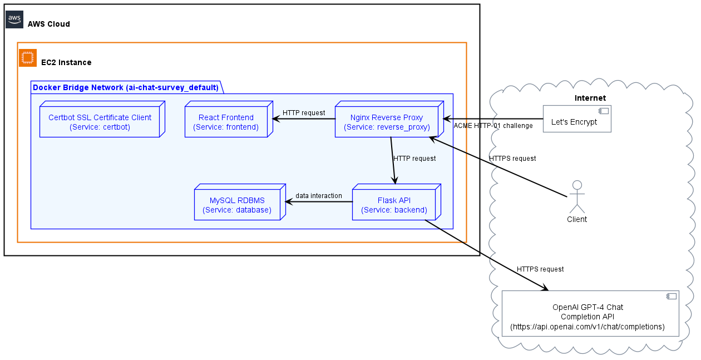

# Tech Report

## Table of Contents

1. [Intro](#intro)
2. [Setup](#setup)
3. [Overall Architecture](#overall-architecture)
4. [Frontend](#frontend)
5. [Backend](#backend)
6. [DevOps](#devops)
7. [Future Directions and Recommendations](#future-directions-and-recommendations)
8. [Conclusion](#conclusion)

## Intro

- Insert intro

## Setup

### Installing the Application

1. Install [Docker](https://www.docker.com/get-started) and [Docker Compose](https://docs.docker.com/compose/install/).

2. Initialise `.env` file (use `copy` for Windows CMD):

   ```shell
   cp sample.env .env
   ```

3. Fill in the `.env` file with the necessary environment variables. Some of the variables are already filled in with default values.

### Running the Application

```shell
docker-compose up -d --build
```

If you want to horizontally scale (application level) the frontend or backend services, you can use the following command (do not scale the database service or nginx service):

```shell
docker-compose up -d --scale frontend=2 --scale backend=2
```

### Stopping the Application

```shell
docker-compose down
```

Further details about setup/installation can be found in [Setup](setup.md), such as:

- Backend Development Environment
- Testing (Backend)
- Frontend Development Environment

## Overall Architecture



### Services

- **Reverse Proxy (Nginx)**: Handles incoming requests and routes them to the backend or frontend. This unifies the frontend and backend under a single domain and allows for easy scaling of the frontend and backend services as well as avoids CORS issues.
- **Frontend (React)**: User interface for the application. It can be scaled horizontally to handle more users.
- **Backend (Flask)**: Handles the business logic and interacts with the database. It can be scaled horizontally to handle more users.
- **Database (MySQL)**: Stores the data for the application.

### Technology Stack

- **Reverse Proxy (Nginx)**: Nginx was chosen due to its simplicity and performance. It is used to route requests to the frontend or backend based on the URL path. Load balancing relies on the Docker network's internal DNS resolution. For more advanced load balancing, solutions like Traefik can be used due to its dynamic configuration capabilities and support for Docker.
- The rationale for the choice of technologies for the other services can be found in the respective sections below.

## Frontend

- [Frontend](frontend.md): Insert Description and details about the frontend components and technologies used.

## Backend

- [Backend](backend.md): Insert Description and details about the backend components and technologies used.

## DevOps

- **Docker**: The application is split into multiple services (frontend, backend, database, nginx) and each service is containerised using Docker.
- **Docker Compose**: The application is orchestrated using Docker Compose. This allows for easy management and deployment of the application and its services. The `docker-compose.yml` file defines the services, environment variables, bind mounts, etc. for the application. Overlapping or alternate compose files are used for additional purposes such as integration testing and model evaluation.
- **GitHub Repository**: The codebase is hosted on a mono-repo on GitHub. This allows for easy access to all parts of the application and ensures that all parts are versioned together. The repository is private and access is restricted to team members.
- **GitHub Pull Requests**: Features are developed on separate branches and merged regularly. Pull requests are used to merge changes into the main branch. Pull requests require approval from code owners of the files changed and must pass the CI pipeline before they can be merged.
- **GitHub Actions**: Continuous Integration (CI) is set up using GitHub Actions. The CI pipeline runs linters to ensure proper formatting as well as integration tests to ensure the application is working as expected. These checks are automated and are required to pass before a pull request can be merged.
- **GitHub Issues**: Issues are used to track tasks, bugs, and enhancements. They are labelled and assigned to team members to keep track of progress.
- **Bash Scripts**: Bash scripts are used to automate common tasks such as local integration testing.
- **Telegram**: A private Telegram group is used for communication between team members. The group uses the "Topics" feature to categorise messages into different topics such as "General", "Frontend", "API", "BRD", "Pull Requests", etc.

## Future Directions and Recommendations

- [Localisation](localisation.md)

## Conclusion

- Insert conclusion goes here.
